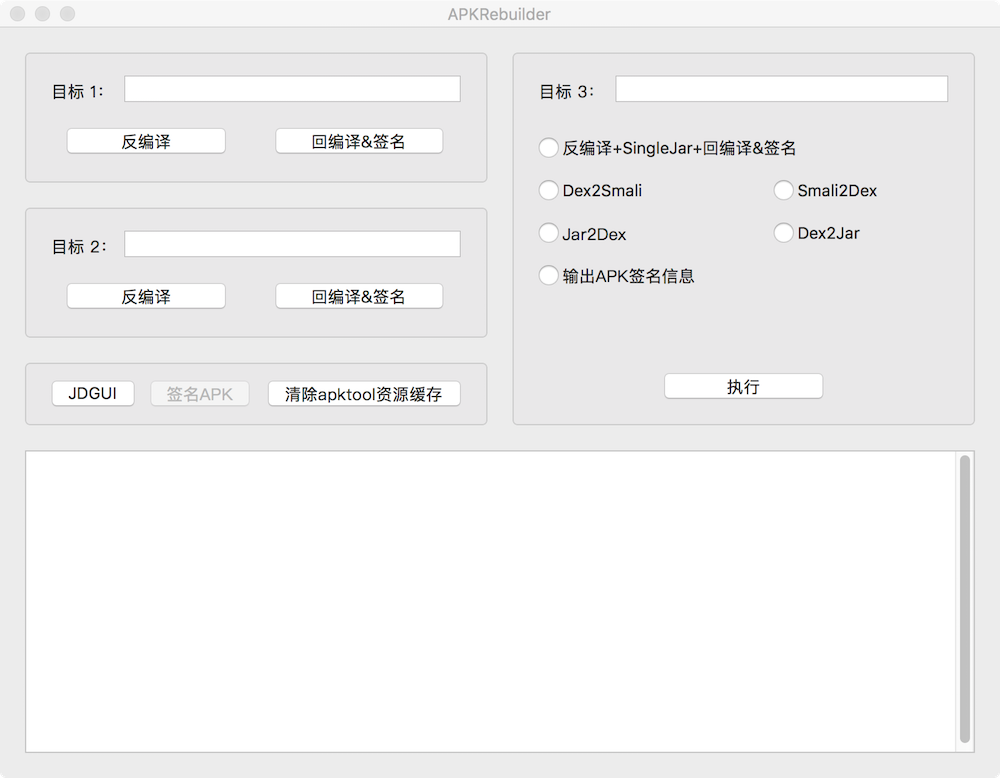

# APKRebuilder

APKRebuilder是Mac平台的APK反编译工具集，目前使用 Xcode10.2.1 + Swift5 开发  
欢迎大家Pull Request和issue  

[Download Release](https://github.com/yuruxuan/APKRebuilder/releases)  

## 界面

## 功能实现

|功能|实现|
|:-|:-:|
|反编译、回编译|apktool|
|签名|apksigner|
|签名信息|keytool|
|dex2smali|smali|
|smali2dex|baksmali|
|dex2jar、jar2dex|dex2jar|

## Q&A
1.不是已经有了 Android Crack Tool，为什么还要造轮子？  
>首先我非常感谢 Android Crack Tool 作者，我的整体的功能设计照抄的；但那个软件很久都没更新过了，比如有时候反编译失败的问题一直没有修复，而且不是开源软件
  
2.为什么要设计三个反编译操作区？  
>以我个人的逆向APK的习惯，我首先会看这个软件是不是加固的；如果不是就直接反编译→重打包→安装运行测试，看下有没有签名验证之类的，如果有签名验证则会在smali部分把这部分逻辑修改掉；此外，有时候还会向逆向的APK包里面添加些相关代码，这个时候就需要这个类的jar。因此我设计了三个操作区，最佳实践如下：  
>①将APK拖入目标3中，选择“反编译+SingleJar+回编译&签名”，点击执行  
>②安装 xxx-b.apk 测试是否可以运行  
>③修改反编译smali  
>④将反编译工程拖入目标1，回编译签名

3.以后会频繁维护么？  
>Maybe

## TODO
单独的签名功能还没做，按钮我置灰了

## 参考和引用库
[apktool](https://ibotpeaches.github.io/Apktool/)  
[apksigner](https://developer.android.google.cn/studio/command-line/apksigner)  
[smali & baksmali](https://github.com/JesusFreke/smali)  
[dex2jar](https://github.com/pxb1988/dex2jar)  

## 协议
Apache 2.0
